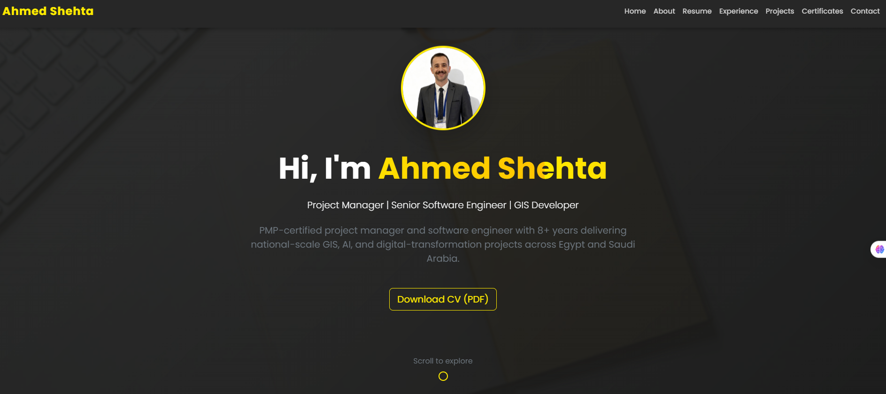
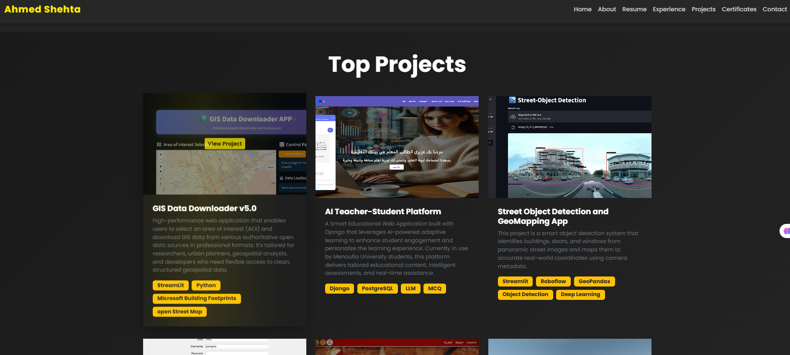
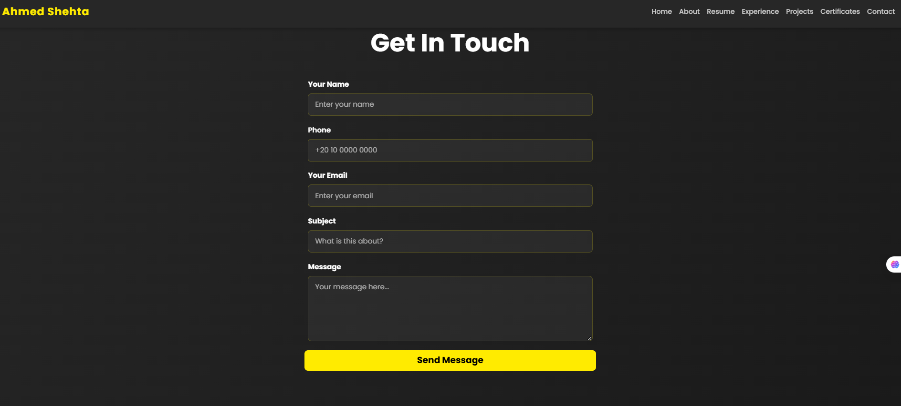

# Ahmed Shehta - Full Stack Developer Portfolio

A modern, responsive personal resume website built with **HTML5**, **CSS3**, **Bootstrap 5**, and **JavaScript**. Features smooth animations, interactive components, and seamless email integration.

## 🎯 Live Demo

[Visit Portfolio](https://ahmed-shehta.netlify.app)

## 📸 Screenshots

### Desktop View

*Full desktop view with hero section and navigation*


*Interactive project showcase with hover effects*


*Working contact form with email integration*


## ✨ Features

- **Responsive Design** — Mobile-first approach, works perfectly on all devices
- **Smooth Animations** — AOS (Animate On Scroll) for engaging page transitions
- **Contact Form** — Integrated with EmailJS for direct email notifications
- **Skill Visualizations** — Animated progress bars and skill chips
- **Project Showcase** — Interactive project cards with hover effects
- **Education & Experience Timeline** — Clean, visual career roadmap
- **Certificate Carousel** — Bootstrap carousel for certificates display
- **Dark Theme** — Modern dark UI with golden (#ffeb00) accent colors
- **Fast Loading** — Optimized images and lazy loading

## 🛠 Tech Stack

- **Frontend**: HTML5, CSS3, JavaScript (ES6+)
- **Framework**: Bootstrap 5.3.0
- **Animations**: AOS (Animate On Scroll), CSS Keyframes
- **Email Service**: EmailJS
- **Icons**: FontAwesome (or your icon library)
- **Fonts**: Google Fonts (Poppins, Montserrat)

## 📊 Project Stats


## 📁 Project Structure

```
v2/
├── index.html              # Main HTML file
├── script.js               # Main JavaScript file
├── custom-bootstrap.css    # Custom CSS overrides & animations
├── images/                 # Image assets
│   ├── profile.png
│   ├── screenshot-*.png
│   └── projects/
├── README.md               # Documentation
└── package.json            # (Optional) Project metadata
```

## 🚀 Getting Started

### Prerequisites
- Web browser (Chrome, Firefox, Safari, Edge)
- Text editor (VS Code recommended)
- Git (optional, for version control)

### Installation

1. **Clone the repository**
   ```bash
   git clone https://github.com/your-username/my-resume.git
   cd my-resume/v2
   ```

2. **Open in browser**
   - Double-click `index.html` to open locally, or
   - Use VS Code Live Server extension

3. **Update personal information**
   - Edit `index.html` with your details (name, email, projects, etc.)
   - Update `script.js` with your EmailJS credentials

## ⚙️ Configuration

### EmailJS Setup

1. Sign up at [EmailJS](https://www.emailjs.com/)
2. Create a service and two templates:
   - **Template 1** (Admin): For receiving user messages
   - **Template 2** (Auto-reply): For sending confirmation to users
3. Update in `script.js`:
   ```javascript
   emailjs.init('3lz9yN1Vp0rHCWaff');
   const SERVICE_ID = 'service_2wfl8yl';
   const TEMPLATE_ADMIN = 'template_z8n4llf';
   const TEMPLATE_USER = 'template_jpz9f6h';
   ```

### Customization

- **Colors**: Edit `:root` variables in `custom-bootstrap.css`
  ```css
  :root {
      --bs-primary: #ffeb00;    /* Golden accent */
      --bs-body-bg: #272727;    /* Dark background */
  }
  ```
- **Navbar**: Modify navbar links in `index.html` `<nav>` section
- **Sections**: Update About, Skills, Projects, Contact in `index.html`

## 📝 Content Sections

| Section | Description |
|---------|-------------|
| **Hero** | Welcome banner with profile intro and CTA |
| **About** | Professional summary with key statistics |
| **Skills** | Animated skill bars and tech stack badges |
| **Projects** | Interactive portfolio with descriptions |
| **Experience** | Career timeline with accordion details |
| **Education** | Educational background & certifications |
| **Certificates** | Carousel of professional credentials |
| **Contact** | Working form with EmailJS integration |

## 📱 Responsive Breakpoints

- **Desktop**: 1200px+ (Full navbar, multi-column layout)
- **Tablet**: 768px – 1199px (Optimized spacing, flex layout)
- **Mobile**: Below 768px (Hamburger menu, single column, touch-friendly)

All elements scale and reflow smoothly across breakpoints.

## 🔧 Troubleshooting

| Issue | Solution |
|-------|----------|
| Navbar overlaps content on mobile | Ensure Bootstrap bundle loaded before `script.js` |
| Email not sending | Verify EmailJS credentials in `script.js` |
| Animations lag | Reduce `duration: 1000` in AOS.init() or disable animations |
| Carousel not auto-playing | Check `bootstrap.js` included; verify `certCarousel` ID |
| Images not loading | Verify image paths in `images/` folder |

## 🚀 Deployment

### Deploy to Netlify (Recommended)

1. Connect GitHub repo to [Netlify](https://www.netlify.com/)
2. Set build directory to `v2/`
3. Deploy with one click — automatic updates on push

**Live Site**: [ahmed-shehta.netlify.app](https://ahmed-shehta.netlify.app)

### Deploy to GitHub Pages

1. Push to GitHub:
   ```bash
   git add .
   git commit -m "Initial portfolio commit"
   git push origin main
   ```

2. Enable GitHub Pages in repository Settings
3. Site live at: `https://your-username.github.io/my-resume/v2/`

### Deploy to Vercel

1. Import GitHub repo on [Vercel](https://vercel.com/)
2. Deploy automatically on every push

## 📄 License

This project is open source under the **MIT License** — feel free to use as a portfolio template.

## 👤 Author

**Ahmed Shehta** — Full Stack Developer

- 📧 Email: [ashehta700@gmail.com](mailto:ashehta700@gmail.com)
- 🔗 GitHub: [@Ahmed-Shehta](https://github.com/your-username)
- 💼 LinkedIn: [Ahmed Shehta](https://linkedin.com/in/your-profile)
- 🌐 Portfolio: [ahmed-shehta.netlify.app](https://ahmed-shehta.netlify.app)

## 💬 Support

Have questions or issues?
- 📝 Open an [Issue](https://github.com/your-username/my-resume/issues)
- 📖 Check [Troubleshooting](#-troubleshooting) section
- 📧 Contact via email or LinkedIn

## 📈 Future Enhancements

- [ ] Dark/Light theme toggle
- [ ] Multi-language support (EN, AR)
- [ ] Blog section with markdown
- [ ] Download CV as PDF
- [ ] Project filters by category
- [ ] GitHub API integration for live repos
- [ ] Analytics dashboard

---

**Last Updated**: December 2025  
**Version**: 2.0  
**Status**: ✅ Live & Maintained